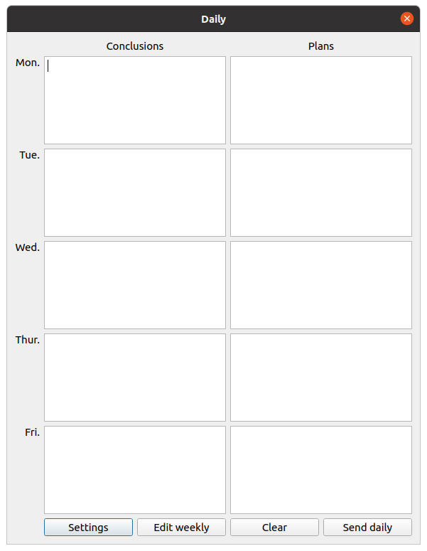
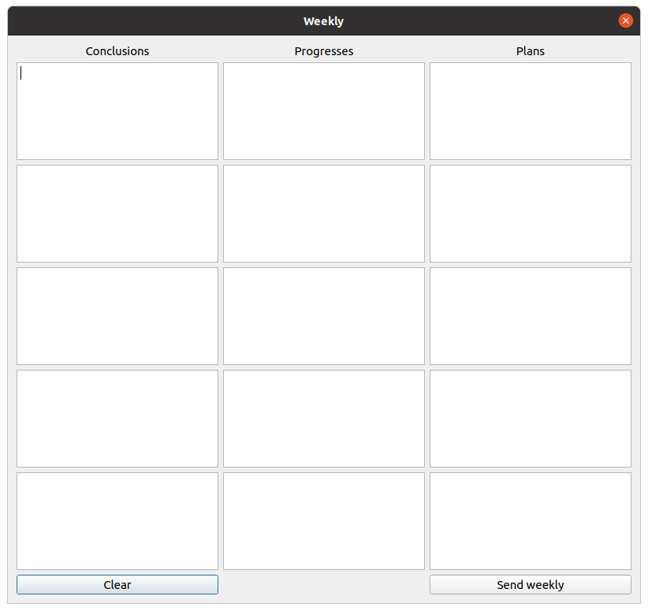
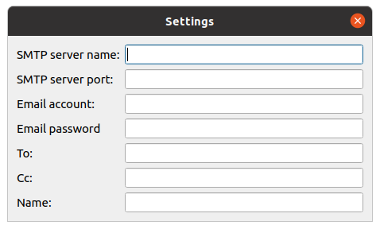

# ReportSender

Automatically render daily and weekly reports and send by email.

## Usage

### Install requirements

```bash
pip install -r requirements.txt
```

### Run

```bash
python report.py
```

## Snapshots





